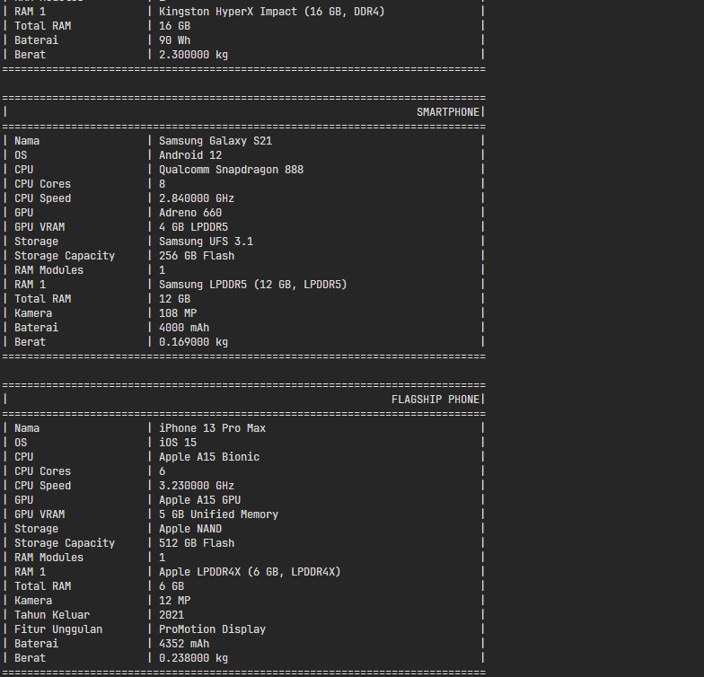

## Janji

Saya Lyan Nazhabil Dzuquwwa dengan NIM 2308428 mengerjakan Tugas Praktikum 3 dalam mata kuliah Desain dan Pemrograman Berorientasi Objek untuk keberkahanNya maka saya tidak melakukan kecurangan seperti yang telah dispesifikasikan. Aamiin.

## Diagram

## Desain Program

Program ini mengimplementasikan sistem yang mendemonstrasikan konsep Multiple Inheritance, Hybrid Inheritance, Hierarchical Inheritance, Multi-Level Inheritance dan juga Composite serta Array of Object. Terdapat beberapa kelas utama:

1. **Komponen** - Kelas dasar untuk komponen komputer (Base Class)
   - Atribut: merk, nama

2. **Komputer** - Kelas untuk perangkat komputer (Composite dan Array of Object)
   - Atribut: nama, cpu, listRam, gpu, storage
   - Hubungan: Komposisi dengan Cpu, Ram, GPU, dan Harddrive

3. **Portable** - Kelas yang mewakili perangkat portabel (Base Class)
   - Atribut: batteryCapacity, weight

4. **Kelas Komponen** (Hierarchical Inheritance)
   - **Cpu** (extends Komponen): jumlahCore, kecepatanGHz
   - **GPU** (extends Komponen): vramGB, memoryType
   - **Ram** (extends Komponen): kapasitasGB, ddr
   - **Harddrive** (extends Komponen): kapasitasGB, tipeDrive

5. **Kelas Perangkat** 
   - **Laptop** (extends Komputer, implements/uses Portable): tipeLaptop, osLaptop (Hybrid Inheritance + Multiple Inheritance)
   - **Smartphone** (extends Komputer, implements/uses Portable): cameraMP, osPhone (Hybrid Inheritance + Multiple Inheritance)
   - **FlagshipPhone** (extends Smartphone): tahunKeluar, fiturUnggulan (Multi-Level Inheritance)

Alasan Desain:

## Alur Program

Program mendemonstrasikan pembuatan dan penggunaan objek-objek dari kelas yang telah didefinisikan:
1. Membuat objek Desktop PC dengan komponen-komponennya
2. Membuat objek Laptop dengan komponen-komponennya
3. Membuat objek Smartphone dengan komponen-komponennya
4. Membuat objek FlagshipPhone dengan komponen-komponennya
5. Menampilkan informasi detail tentang setiap perangkat dengan format tabel

Untuk menjalankan program:
- **C++**: Jalankan file main.cpp
- **Java**: Jalankan file main.java
- **Python**: Jalankan file main.py

## Dokumentasi

### C++

### Java

### Python

